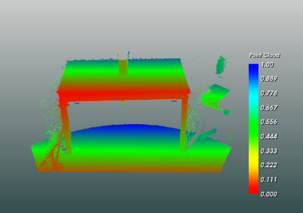

​                                                                                                    

​                                                  

## 重要更新

2022629，昨天有个用户使用了我的库，但报“未加载PclDLL”这个错误，经过远程指导，终于发现是因为自己在Io模块中增添了VTK相关的函数，但是没在依赖中添加VTK相关的dll。目前这个问题已解决。VTK相关的Dll已经放在depend/x64目录中。

## 1 简介

**（因为境内访问GitHub网络会不稳定，所以可能无法看到图片。如果出现这种情况，请多刷新几次网页，还是不行的话，只能挂个VPN或者换个时间段访问。）**

对于3D点云处理来说，Pcl点云库必不可少。如果说OpenCV是2D信息获取与处理的结晶，那么Pcl就在3D信息获取与处理上具有同等地位。但不同于opencv拥有众多.NET包装，如OpencvSharp、emgucv等，**目前并没有可靠的Pcl的.NET包装**（PclSharp已经好几年没有维护，而现行版本又bug太多。），这不利于.NET用户开发3D点云的相关应用。

为解决这个问题，笔者开发了Pcl点云库的.NET包装：PclCSharp。该库封装的是**Pcl1.8.1版本**，主要集成了pcl库的点云处理功能，**但没有封装点云可视化功能**。因为在pcl中，点云可视化是靠vtk实现的，而vtk有C#的版本。**用户可以使用vtk可视化点云，使用该库对点云进行处理**。目前该库仅支持Windows10 X64平台。

## 2 使用方法

**先给本仓库点个 star，给我一个继续创作的动力**，该库绝对值你一个 star。如果在使用过程中发现任何bug，可以邮箱联系我2237380450@qq.com，我会一直维护该库。

本库是在**VS2017、.NET Framework4.6.1**框架中进行封装的，主要封装了四个Dll，分别是PointCloudSharpDll、PclCSharp、PointCloudDll和PclDll。其中**前两个是用C#封装的Dll，它们是对后两个dll的包装**。它们之间具体的依赖关系见下图。

在实际使用时，只需要在.net中**引用PointCloudSharpDll、PclCSharp这两个dll即可**。但是需要把其他两个dll以及这两个dll依赖的所有dll全部放在exe所在目录。当然，你也可以放在system32目录，或者放在环境变量指定的文件夹。笔者建议放在exe所在目录中。**依赖的dll全部放在depend/x64目录中**。

切记，**下图所列的所有dll必须一个不漏的和PointCloudSharpDll、PclCSharp这两个dll放在一起**，不然会报System.DllNotFoundException:“无法加载 DLL这个错误。

还有一点需要注意，对于pcl_common_release这个dll，它依赖的都是系统级的dll和C++运行时的dll。对于系统级的dll，只要是正常的window10系统（笔者是在win10上封装的，所以得是win10系统）都会在system32目录中包含相应的dll，所以无需额外添加。至于C++的dll，大部分安装了编程软件的电脑也都会包含，所以也无需额外添加。

**用户只需将bin目录下的PointCloudSharpDll、PclCSharp、PointCloudDll和PclDll四个dll和depend/x64目录中的所有dll一起放在exe所在路径中即可使用**。

## 3 命名空间介绍

### 3.1 PointCloudSharp命名空间

PointCloudSharp中封装了**该库的数据结构**。目前将`pcl::PointCloud<pcl::PointXYZ>`、`vector<pcl::PointIndices>`这两类数据结构进行了封装，对应C#的类为`PointCloudXYZ`、`PointIndices`。其他的数据结构后续逐步封装。**具体见doc目录中的函数说明**。

### 3.2 PclCSharp命名空间

该命名空间中包含了pcl中点云处理的算法，暂时封装了Io、Filter、Segmentation、SampleConsensus和Util五个静态类，每个类大体对应着pcl的一个模块，后续会慢慢增加其他模块。各个类之间的关系见下图。**具体见doc目录中的函数说明**。

## 4 函数demo

在demo目录中，提供了C#语言的示例。该demo包含各个模块的示例程序。**具体函数实现请见demo目录**。**相关的点云文件可在source目录中找到**。

### 4.1 IoDemo

该demo主要是关于Io模块的示例程序，在该demo中，笔者演示了**如何加载pcd、ply、obj、stl格式的文件**，并使用vtk进行可视化，除此之外，**还可使用该demo将加载的文件保存为pcd或者ply格式的文件**。结果见下图。

### 4.2 FilterDemo

该demo主要是关于Filter模块的示例程序。在该demo中，笔者演示了如何对**桌子文件(table_scene_lms400.pcd)**进行**体素下采样、均匀下采样、半径滤波、统计滤波、直通滤波**等，并使用vtk进行可视化。

桌子点云图见下

对其进行体素下采样，采样参数设置为0.08，结果见下。可以看到桌子点云变的很稀疏了。

对其进行统计滤波，邻域参数设置为40，阈值设置为1，结果见下。可以桌子的稀疏离群点都被去除。

对其进行半径滤波，搜索半径设置为0.08，阈值个数设置为40，结果见下。可以桌子左边的一部分离群点被去除。

对其进行直通滤波，需要滤波的轴设置为x轴，x最小值为0.4，最大为1，结果见下。

