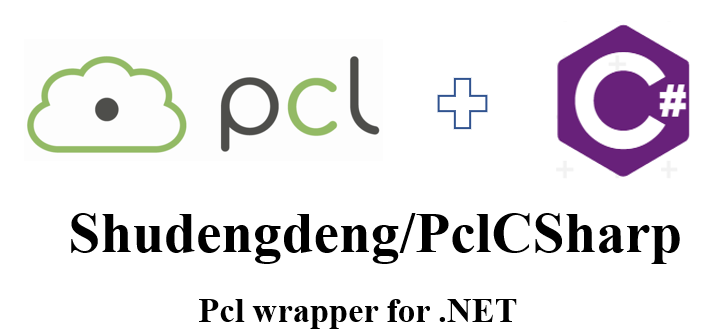
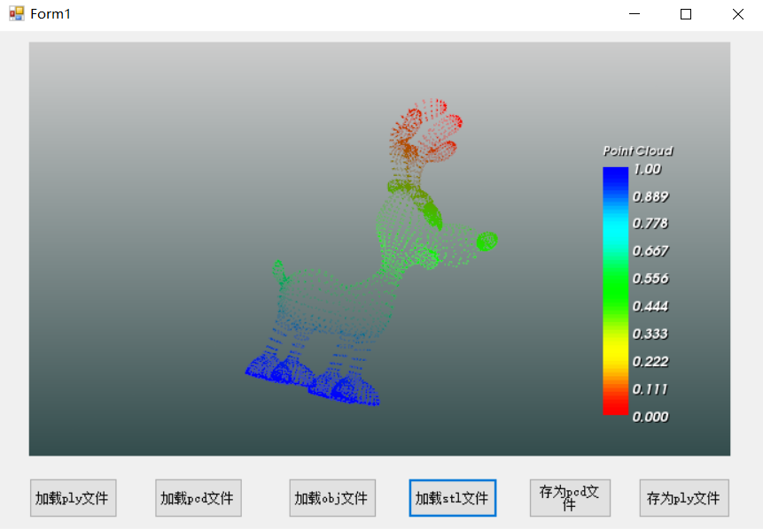

# PclCSharp

## 简介

对于3D点云处理来说，Pcl点云库必不可少。如果说OpenCV是2D信息获取与处理的结晶，那么Pcl就在3D信息获取与处理上具有同等地位。但不同于opencv拥有众多.NET包装，如OpencvSharp、emgucv等，**目前并没有可靠的Pcl的.NET包装**（PclSharp已经好几年没有维护，而现行版本又bug太多。），这不利于.NET用户开发3D点云的相关应用。

为解决这个问题，笔者开发了Pcl点云库的.NET包装：PclCSharp。该库封装的是**Pcl1.8.1版本**，主要集成了pcl库的点云处理功能，**但没有封装点云可视化功能**。因为在pcl中，点云可视化是靠vtk实现的，而vtk有C#的版本。**用户可以使用vtk可视化点云，使用该库对点云进行处理**。目前该库仅支持Windows10 X64平台。

## 1 使用方法

本库是在**VS2017、.NET4.6.1**框架中进行封装的，主要封装了四个Dll，分别是PointCloudSharpDll、PclCSharp、PointCloudDll和PclDll。其中**前两个是用C#封装的Dll，它们是对后两个dll的包装**。它们之间具体的依赖关系见下图。

在实际使用时，只需要在.net中**引用PointCloudSharpDll、PclCSharp这两个dll即可**。但是需要把其他两个dll以及这两个dll依赖的所有dll全部放在exe所在目录。当然，你也可以放在system32目录，或者放在环境变量指定的文件夹。笔者建议放在exe所在目录中。**依赖的dll全部放在depend/x64目录中**。

切记，**下图所列的所有dll必须一个不漏的和PointCloudSharpDll、PclCSharp这两个dll放在一起**，不然会报System.DllNotFoundException:“无法加载 DLL这个错误。

还有一点需要注意，对于pcl_common_release这个dll，它依赖的都是系统级的dll和C++运行时的dll。对于系统级的dll，只要是正常的window10系统（笔者是在win10上封装的，所以得是win10系统）都会在system32目录中包含相应的dll，所以无需额外添加。至于C++的dll，大部分安装了编程软件的电脑也都会包含，所以也无需额外添加。

**用户只需将bin目录下的PointCloudSharpDll、PclCSharp、PointCloudDll和PclDll四个dll和depend/x64目录中的所有dll一起放在exe所在路径中即可使用**。

## 2 PointCloudSharp命名空间

PointCloudSharp中封装了pcl中存储点云的基本数据结构，包括`pcl::PointCloud<pcl::PointXYZ>`、`vector<pcl::PointIndices>`和`pcl::PointCloud<pcl::Normal>`等。目前封装好的只有`pcl::PointCloud<pcl::PointXYZ>`、`vector<pcl::PointIndices>`这两类，其他的数据结构后续逐步封装。**具体见doc目录中的函数说明**。

## 3 PclCSharp命名空间

该命名空间中包含了pcl中点云处理的算法，暂时封装了Io、Filter、Segmentation、SampleConsensus和Util五个静态类，每个类大体对应着pcl的一个模块，后续会慢慢增加其他模块。各个类之间的依赖关系见下图。具体见doc目录中的函数说明。

## 4 函数demo

在demo目录中，提供了C#语言的示例。该demo包含各个模块的示例程序。**具体函数实现请见demo目录**。**相关的点云文件可在source目录中找到**。

### 4.1 IoDemo

该demo主要是关于Io模块的示例程序，在该demo中，笔者演示了**如何加载pcd、ply、obj、stl格式的文件**，并使用vtk进行可视化，除此之外，**还可使用该demo将加载的文件保存为pcd或者ply格式的文件**。结果见下图。

